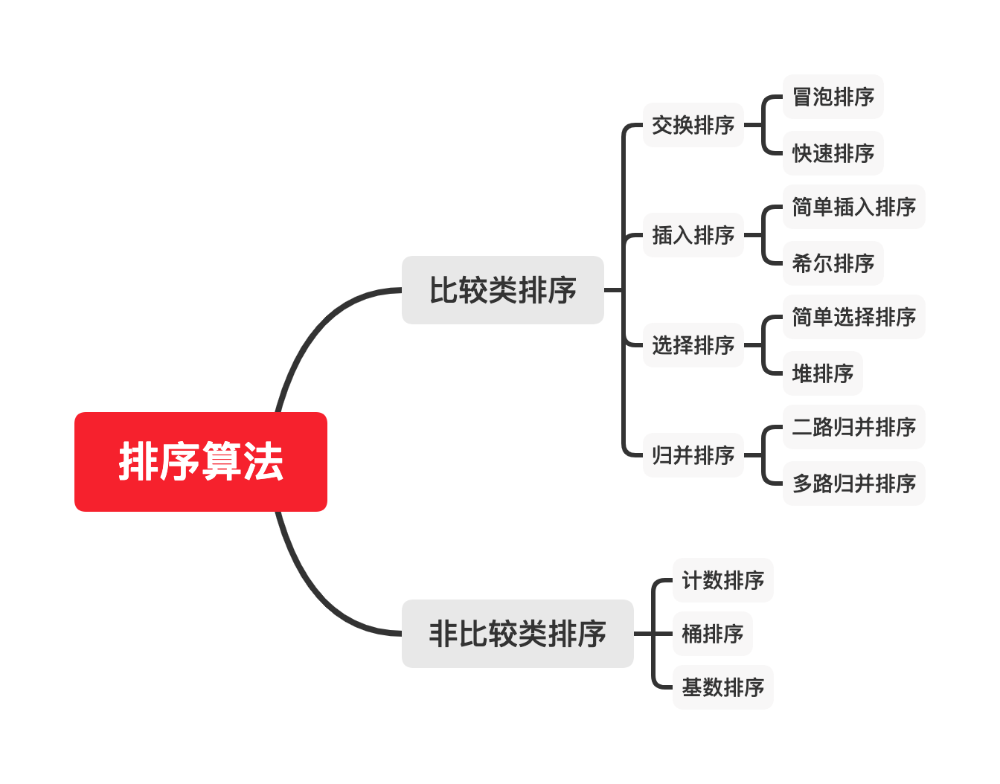

# [Week6] - 学习笔记

## 排序算法

### 比较类排序

通过比较来决定元素间的相对次序, 由于其时间复杂度不能突破 $O(n\log{n})$, 因此也称为非线性时间比较类排序

### 非比较类排序

不通过比较来决定元素间的相对次序, 他可以突破基于比较排序的时间下界, 以线性时间运行, 因此也称为线性时间非比较类排序.

| 排序方法 | 时间复杂度(平均)  | 时间复杂度(最坏)  | 时间复杂度(最好)  |    空间复杂度     | 稳定性 |
| :------: | :---------------: | :---------------: | :---------------: | :---------------: | :----: |
| 插入排序 |    $O(n^{2})$     |    $O(n^{2})$     |      $O(n)$       |      $O(1)$       |  稳定  |
| 希尔排序 |   $O(n^{1.3})$    |    $O(n^{2})$     |      $O(n)$       |      $O(1)$       | 不稳定 |
| 选择排序 |    $O(n^{2})$     |    $O(n^{2})$     |    $O(n^{2})$     |      $O(1)$       | 不稳定 |
|  **堆排序**  | $O(n\log_{2}{n})$ | $O(n\log_{2}{n})$ | $O(n\log_{2}{n})$ |      $O(1)$       | 不稳定 |
| 冒泡排序 |    $O(n^{2})$     |    $O(n^{2})$     |      $O(n)$       |      $O(1)$       |  稳定  |
| **快速排序** | $O(n\log_{2}{n})$ |    $O(n^{2})$     | $O(n\log_{2}{n})$ | $O(n\log_{2}{n})$ | 不稳定 |
| **归并排序** | $O(n\log_{2}{n})$ | $O(n\log_{2}{n})$ | $O(n\log_{2}{n})$ |      $O(n)$       |  稳定  |
|          |                   |                   |                   |                   |        |
| 计数排序 |     $O(n+k)$      |     $O(n+k)$      |     $O(n+k)$      |     $O(n+k)$      |  稳定  |
|  桶排序  |     $O(n+k)$      |    $O(n^{2})$     |      $O(n)$       |     $O(n+k)$      |  稳定  |
| 基数排序 |     $O(n*k)$      |     $O(n*k)$      |     $O(n*k)$      |     $O(n+k)$      |  稳定  |

### 初级排序

1. 选择排序(Selection Sort)
   
   每次找最小值, 然后放到待排序数组的起始位置.
2. 插入排序(Insertion Sort)
   
   从前到后逐步构建有序序列; 对于未排序的数据, 在已排序序列中从后向前扫描, 找到相应位置并插入.
3. 冒泡排序(Bubble Sort)
   
   嵌套循环, 每次查看相邻的元素, 如果逆序则交换

